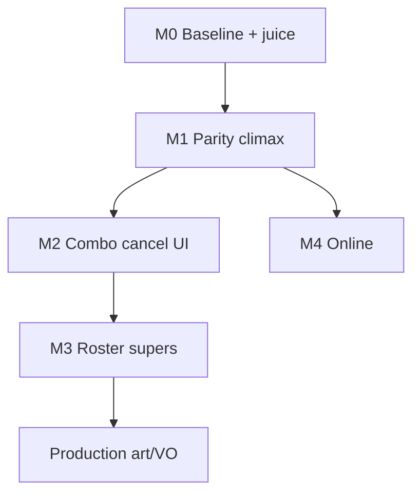
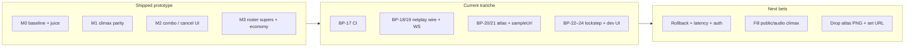

# Blood Arena — master upgrade plan

**Purpose:** single north-star document for design + engineering: what “done” looks like, how work is sequenced, and where it lives in code.  
**Companion:** [`FIGHTING_GAME_ROADMAP.md`](./FIGHTING_GAME_ROADMAP.md) (tactical shipped list), [`futureUpgrades.ts`](../src/features/arena/futureUpgrades.ts) (in-app catalog).  
**Professional design contract (promises, pillar order, T1–T4 rubric, anti-goals):** **§15**.

### Upgrade sequence (executive)

1. **Baseline + parity** — core sim, juice, climax meter, P2/dummy (M0–M1).  
2. **Readable expression** — combo readout, link windows, scaling, meter economy, cancel **data** on UI (M2–M3, BP-04–07, 10–11).  
3. **Roster-complete fantasy** — every `FighterId` has card `climaxOverride` + link-route hints where needed (`BP-12`, `classData`, `cancelRouteConfig`).  
4. **Production** — sprite + VO pipeline **locked** below (`BP-09`).  
5. **Online** — deterministic sim cleanup + transport on top of netplay spec (`BP-08`, `simDeterminism.ts`).

---

## 1. North star

- **PvP-first, hot-seat excellent:** both players use the **same** combat rules, inputs, and expression tools (meter, climax, skills).
- **Readability before spectacle:** range, stance, tempo, and round rules remain obvious; juice is capped and tunable in [`combatJuiceConfig.ts`](../src/features/arena/combatJuiceConfig.ts).
- **Reference bar:** SF/KOF-style **weight** and **climax beats**, adapted to a browser prototype (no fake depth).

---

## 2. Work streams (parallel tracks)

| Stream | Outcome | Primary code |
|--------|---------|----------------|
| **A. Fairness / parity** | P1 and P2 have equivalent meters, climax, and (later) combo affordances | `arenaTypes`, `arenaActions`, `SkillBar`, `FighterPanel`, `opponentInputMapping` |
| **B. Feel (juice)** | Hitstop, shake, KO beat, announcer, climax freeze | `combatJuiceConfig`, `useCombatFeedback`, `globals.css` |
| **C. Expression** | Combos/cancels, richer supers, character-specific fantasy | `arenaActions` (frame-ish data), UI feedback, `classData` |
| **D. Production** | Sprites, VO, stages, polish | assets + render pipeline (future) |
| **E. Online** | Rollback netplay | `onlineNetplayStub.ts` spec + `simDeterminism.ts` audit until transport |

Streams **A + B** are prerequisites for trustworthy playtests. **C** builds on log/sim discipline. **D/E** are optional product bets.

---

## 3. Phased delivery (milestones)

### Milestone M0 — Baseline (shipped)

- Core sim, modifiers, tempo, persistence, training dummy, local PvP.
- Phase 1 juice: hitstop, shake, KO beat/zoom, announcer stingers.

### Milestone M1 — Parity & climax (**shipped** in prototype)

- **Per-fighter climax meter** on `FighterState` (deal/taken HP builds meter for *that* fighter).
- **P2 climax** — **M** / numpad **\*** + `FighterPanel` hot-seat HUD; **dummy** prioritizes climax when full + in range.
- Config: [`climaxMeterConfig.ts`](../src/features/arena/climaxMeterConfig.ts); actions: `USE_CLIMAX` / `OPPONENT_USE_CLIMAX`.

### Milestone M2 — Combo & cancel (**prototype shipped**)

- **Combo readout:** log-derived **×2+** chains per side (`useComboChainDisplay`, `ComboChainToast`); **gap** and **blocked** rules in [`comboChainConfig.ts`](../src/features/arena/comboChainConfig.ts).
- **Cancel link (UI + sim):** `FighterState.cancelWindowUntilMs` set on **clean** HP connects; P1 **SkillBar** rings dash/skills; P2 **FighterPanel** hot-seat line; keyboard reference explains link.
- **Still TBD (M2+):** frame tables, strict whiff-cancel validation in sim, tutorial mode.
- **Data (BP-06):** per-roster **link highlights** in [`cancelRouteConfig.ts`](../src/features/arena/cancelRouteConfig.ts) (UI teaching; inputs stay legal).
- Success (current): spectators see **chain count** and **which actions** read as links after clean hits.

### Milestone M3 — Character & super depth (**prototype slice shipped**)

- **Faction climax** — damage + log name by `FighterDefinition.faction` in [`climaxStrikeProfile.ts`](../src/features/arena/climaxStrikeProfile.ts) (e.g. *Primal / Sanctified / Overdrive / Blackout Climax*).
- **Meter economy** — basic **whiff** meter + defender **chip** bonus in [`climaxMeterConfig.ts`](../src/features/arena/climaxMeterConfig.ts); wired in `arenaActions`.
- **Sim combo scaling** — clean-hit chain depth on `FighterState` + `comboOutgoingDamageMultiplier` in [`comboChainConfig.ts`](../src/features/arena/comboChainConfig.ts).
- **Per-card climax** — **`climaxOverride` on every roster row** in [`classData.ts`](../src/features/arena/classData.ts); resolver in [`climaxStrikeProfile.ts`](../src/features/arena/climaxStrikeProfile.ts).
- **Committed damage-ability whiff** — spends resource + CD, log + meter (`CLIMAX_METER_ABILITY_DAMAGE_WHIFF`) in `arenaActions`.
- **Climax sting (audio)** — faction + sampled card tones on `unleashes …!` (`BP-15`, `resolveClimaxStinger`).
- **Still TBD:** `public/` OGG per card, full guard-push meter, frame-accurate supers.

### Milestone M4 — Scale (**in progress**)

- Air/lane experiments *only* if ground clarity holds.
- Online: rollback **wire types**, **`NetplayTransport`**, **`createMemoryNetplayPair`**, JSON **wire codec** + **browser WebSocket adapter** ([`netplayWireCodec.ts`](../src/features/arena/netplayWireCodec.ts), [`webSocketNetplayTransport.ts`](../src/features/arena/webSocketNetplayTransport.ts)); determinism notes in [`simDeterminism.ts`](../src/features/arena/simDeterminism.ts). Matchmaking / relay server still TBD.

---

## 4. Dependency graph (simplified)

---

## 5. Metrics (keep measuring)

- **Time-to-read** round rule & stance without scrolling log.
- **Parity check:** P2 can perform every P1 combat action the design promises (meter, climax, skills, block, dash).
- **Clarity under juice:** whiff vs hit reasons stay correct with juice on.
- **Reset friction:** rematch ≤ one clear intent (R / Esc / Enter).
- **Regression guard:** `npm run test` (Vitest) — netplay memory pair, netplay JSON codec, relay downlink parser, lockstep + replay, climax sting resolver, climax log parse.

---

## 6. Risks & mitigations

| Risk | Mitigation |
|------|------------|
| Juice hides reads | Single tuning surface; reduced motion; cap zoom/shake |
| Scope creep (air/online) | Gate M4 on M1–M2 sign-off |
| AI feels “cheap” with climax | Same meter rules as human; noisy / lane-based use |

---

## 7. Implementation backlog (executable checklist)

| ID | Milestone | Deliverable | Owner / area | Status |
|----|-----------|-------------|--------------|--------|
| BP-01 | M0 | Core sim, modifiers, HUD, persistence | `arenaActions`, `initialArenaState` | Done |
| BP-02 | M0 | Phase 1 juice (hitstop, shake, KO, announcer) | `combatJuiceConfig`, `useCombatFeedback` | Done |
| BP-03 | M1 | Per-fighter climax + P2 input + dummy | `climaxMeterConfig`, `FighterPanel`, `arenaDummyAi` | Done |
| BP-04 | M2 | Combo display (log + clock) | `useComboChainDisplay`, `ComboChainToast` | Done |
| BP-05 | M2 | Cancel link window + UI rings | `cancelWindowUntilMs`, `SkillBar` | Done |
| BP-06 | M2+ | Per-roster cancel **link** highlights | `cancelRouteConfig.ts`, SkillBar, FighterPanel | Done (UI) |
| BP-07 | M3 | Faction + optional card climax + meter economy | `climaxStrikeProfile`, `climaxMeterConfig`, `classData`, `arenaActions` | Done (prototype) |
| BP-08 | M4 | Rollback spec + `NetplayTransport` + memory pair + JSON codec + WS adapter | `onlineNetplayStub.ts`, `netplayWireCodec.ts`, `webSocketNetplayTransport.ts` | POC + wire |
| BP-09 | D | Sprite / VO pipeline decision | **§9** below; `public/` audio | Recorded |
| BP-10 | M2+ | Sim combo damage scaling | `comboChainConfig`, `FighterState.comboChainDepth` | Done |
| BP-11 | M3 | Committed damage-ability whiff + meter | `arenaActions`, `climaxMeterConfig` | Done |
| BP-12 | M3 | Full roster `climaxOverride` + link-route coverage | `classData.ts`, `cancelRouteConfig.ts` | Done |
| BP-13 | M4 | Combat-path determinism (log ids + dummy PRNG) | `simDeterminism.ts`, `arenaActions`, `arenaDummyAi`, `arenaResources` | Done |
| BP-14 | D / W3 | Canvas 2D combat readout (BP-09 phase 1) | `ArenaCombatCanvas`, `arenaCanvasConfig`, `ArenaStage` | Done |
| BP-15 | D / §9 | Faction + **card** climax stinger (`resolveClimaxStinger`) + log hook | `climaxStingerConfig`, `combatAudio`, `useCombatSounds`, `combatLogParse` | Done |
| BP-16 | — | Vitest harness for arena **pure** modules | `vitest.config.ts`, `*.test.ts`, `npm run test` | Done |
| BP-17 | — | **CI** — test + lint + build on push/PR | `.github/workflows/ci.yml` | Done |
| BP-18 | M4 | **Netplay wire codec** (parse/stringify, Vitest) | `netplayWireCodec.ts` | Done |
| BP-19 | M4 | **`createWebSocketNetplayTransport`** (browser) | `webSocketNetplayTransport.ts` | Done |
| BP-20 | D / W3 | **Optional atlas** under canvas fighters (`url: null` = pillars) | `arenaCombatSpriteConfig.ts`, `ArenaCombatCanvas.tsx` | Done |
| BP-21 | D / §9 | **`sampleUrl`** on climax rows → HTMLAudio with procedural fallback | `climaxStingerConfig.ts`, `combatAudio.ts` | Done (hook) |
| BP-22 | M4 / W5 | **Lockstep bridge** — `ArenaInputFrame` edges + `TICK`, slice merge, `compactArenaChecksum` | `arenaNetplayLockstep.ts` | Done (sim hook) |
| BP-23 | M4 / W5 | **`replayInputConfirmMessages`** + **`peerAdvanceFromArena`** (wire → sim → checksum) | `arenaNetplayLockstep.ts` | Done |
| BP-24 | M4 / W5 | **Dev lockstep page** — fixed tick + memory transport + `ArenaStage` | `useArenaLockstepHotSeatDev.ts`, `app/dev/netplay-lockstep/page.tsx` | Done |
| BP-25 | M4 | **`npm run relay`** + `NEXT_PUBLIC_NETPLAY_RELAY_URL` + **Online (relay)** mode in main arena | `scripts/netplay-relay.mjs`, `useArenaEngine.ts`, `NETPLAY_LOCKSTEP_FRAME` | Done (prototype) |
| BP-26 | M4 | **Relay downlink parser** — typed `hello` / `frame_tick` + codec delegation + Vitest | `netplayRelayClientMessages.ts` | Done |
| BP-27 | Design / M2 | **Round-start readability cues** — coaching copy + longer toast + SR announcement | `arenaReadabilityHints.ts`, `RoundStartOverlay.tsx` | Done |
| BP-28 | Design / M2 | **Round-resolve causality recap** — log-derived one-liner after KO (Climax / clean / chip) + SR | `arenaRoundRecap.ts`, `ArenaScreen` match banner | Done |
| BP-29 | Design / M2 | **Hot-seat P2 parity cue** — default P2 bindings on round-start toast + SR narration; longer toast in `local_human` | `arenaReadabilityHints.ts`, `RoundStartOverlay`, `useRoundStartAnnouncement` | Done |

## 8. Next waves (rolling)

| Wave | Focus | Exit criteria |
|------|--------|----------------|
| **W1** | Ground clarity + hot-seat parity | P1/P2 same meters, link read, no regressions in log |
| **W2** | Expression data | Cancel highlights + card climaxes + scaling + economy tunable in config |
| **W3** | Production bet | Canvas layer **shipped** (`BP-14`); first **Aseprite atlas** hooked to same X mapping |
| **W4** | Online bet | Memory pair + **JSON codec tests**; **`createWebSocketNetplayTransport`** for relay wiring |
| **W5** | Integration | **BP-22–25** relay lockstep on `remote`; next: rollback, latency hide, production relay auth |

## 9. Production / sprite pipeline (BP-09)

**Decision (prototype → first ship):**

1. **Characters** — 2D **raster** assets: keyed PNG sequences or texture atlases exported from **Aseprite** (or equivalent). One “combat silhouette” scale target so hit readability matches current UI lane.
2. **Runtime** — phase 1: [`ArenaCombatCanvas.tsx`](../src/components/arena/ArenaCombatCanvas.tsx) + [`arenaCanvasConfig.ts`](../src/features/arena/arenaCanvasConfig.ts) (lane + pillar readout under HTML fighters; toggle `ARENA_COMBAT_CANVAS_ENABLED`). Defer **Pixi/Three** until atlas count justifies it.
3. **VO / SFX** — **`resolveClimaxStinger(fighterId, faction)`** on `… unleashes …!` lines (`climaxStingerConfig.ts`); optional **`sampleUrl`** per card (e.g. `public/audio/climax/*.ogg`) with **HTMLAudio** + procedural fallback in `combatAudio.ts`.
4. **Out of scope for now** — Spine/DragonBones licensing, full story mode cinematics.

## 10. Revision

Update this file when a **milestone** status changes; keep `FIGHTING_GAME_ROADMAP.md` and `futureUpgrades.ts` aligned with what players can actually do in build.

## 11. Overall upgrade map (single page)

**Execution order for “full upgrade”:** keep **W1–W2** regressions at zero → land **CI (BP-17)** → extend **online wire (BP-18/19)** until a relay can exchange `input_confirm` slices → **`replayInputConfirmMessages`** + **`peerAdvanceFromArena`** for desync probes → **`npm run relay`** + **`NEXT_PUBLIC_NETPLAY_RELAY_URL`** + **Online (relay)** on the main arena (**BP-25**) → drop **OGG** for `sampleUrl` rows → set **`ARENA_COMBAT_SPRITE_ATLAS.url`** when art exists → only then expand **M4** rollback depth or **air/lane** experiments.

## 12. Big plan — at a glance

1. **Combat readability** — hot-seat parity, log discipline, juice caps (`M0–M2`, streams A/B); round start (**BP-27** + **BP-29** P2 strip) + round-over recap (**BP-28**).  
2. **Expression** — combos, cancels, climax economy, roster data (`M3`, stream C).  
3. **Production** — canvas layer, optional atlas URL, optional `sampleUrl` VO (`BP-09`, §9, `BP-14/20/21`).  
4. **Online** — types + memory pair + JSON codec + WebSocket adapter + lockstep replay + checksum (`BP-08/18/19/22/23`).  
5. **Quality bar** — Vitest + GitHub Actions CI (`BP-16/17`).  
6. **Next major code bet** — rollback + input prediction + checksum mismatch recovery (beyond lockstep confirm queue).

## 13. Phases (rollup)

| Phase | Scope | Status |
|-------|--------|--------|
| **Pα** | M0–M3 combat readability + expression + CI | Shipped in prototype |
| **Pβ** | Netplay types → wire codec → lockstep → replay → dev page → **relay + `remote`** (BP-08–26) | Shipped (relay prototype) |
| **Pγ** | Production art: `public/audio`, atlas URL, VO polish | Partial hooks only |
| **Pδ** | Rollback netcode, relay auth/rooms, desync UX | Not started |

**Rule of thumb:** finish **Pγ** art hooks that touch shipped UX, then invest in **Pδ** only if competitive online is a product bet.

## 15. Design north star (professional)

This section is the **game-design contract**: what players should *feel* and *understand*, independent of implementation tickets.

### 15.1 Player promises

| Promise | Design meaning | Shipped signal |
|---------|----------------|----------------|
| **Same rules, both sides** | No “PvE rules” that break in PvP | Hot-seat + dummy + relay use one reducer path |
| **I can read why I lost** | Causality beats spectacle | Combat log, hitstop tiers, round start (**BP-27**) + round-over recap (**BP-28**) |
| **Expression is fair** | Depth without arcane knowledge | Combo toast, cancel rings, meter/climax clarity |
| **Juice supports reads** | FX never replaces information | `combatJuiceConfig` caps + reduced motion |

### 15.2 Design pillars (priority order)

1. **Clarity** — range, stance, round modifier, resource tempo. If a new feature hides these, it ships behind a toggle or not at all.  
2. **Parity** — P2 and P1 must be able to run the same mental model (mirror HUD affordances where possible).  
3. **Fantasy** — roster voice through climax names, stingers, future VO/art — *after* clarity holds in playtests.  
4. **Rhythm** — match modifiers intentionally reshape risk (`MATCH_MODIFIER_CYCLE`); players should *feel* the shift in tempo, not discover it only in the log.  
5. **Trust** — online: deterministic sim + visible desync strategy (future); local: obvious reset/rematch (**BP-27** hot-seat line).

### 15.3 Playtest rubric (qualitative, repeatable)

Use in **5–10 minute** sessions; pass = 3/4 players agree.

- **T1 — Rule read:** After the round-start toast, can the player state *one* risk change for this modifier without scrolling the log?  
- **T2 — Parity:** P2 describes how climax and skills work for *their* side without asking P1 (on-screen: **BP-29** round-start P2 strip + keyboard reference).  
- **T3 — Juice honesty:** With combat FX on, players still correctly identify whiff vs blocked vs hit *reason* (not only damage number).  
- **T4 — Reset friction:** Rematch in ≤1 intentional action after round resolve.

### 15.4 Anti-goals (design debt traps)

- Air lanes or advanced movement **before** ground neutral reads clean in T1–T3.  
- New characters **before** every `FighterId` climax/link teaching surface is honest in UI.  
- Netplay rollback **before** relay lockstep proves fun in **T2** (hot-seat excellence first).

### 15.5 Engineering ↔ design mapping

- **Readability cues** → **BP-27** (`arenaReadabilityHints`, `RoundStartOverlay`).  
- **Hot-seat parity (T2)** → **BP-29** (P2 bindings on round-start toast + `hotSeatP2ControlsSrNarration`).  
- **Post-KO causality (T3)** → **BP-28** (`arenaRoundRecap`, match banner recap line).  
- **Modifier fantasy** → `matchModifiers` + log lines + BP-27 lead/coaching.  
- **Online trust** → BP-25/26 + future Pδ desync UX.
